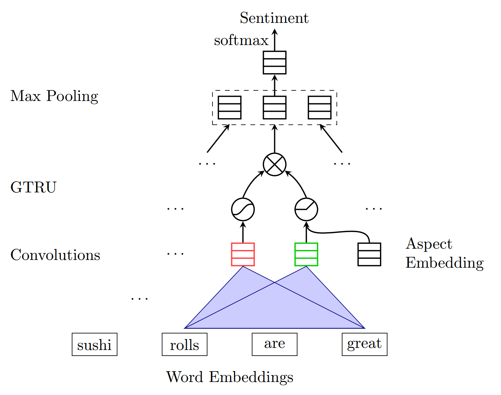
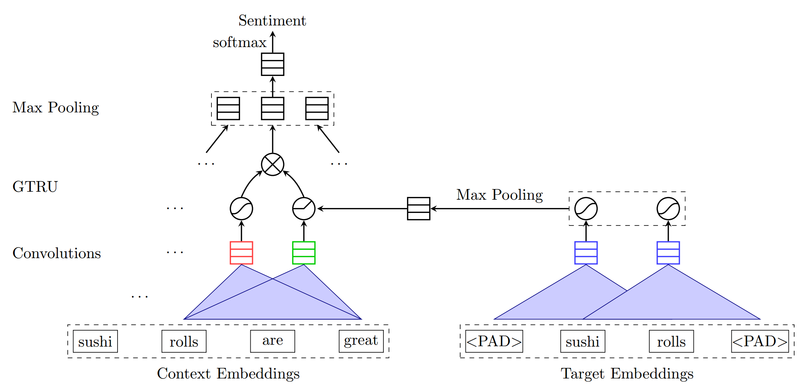
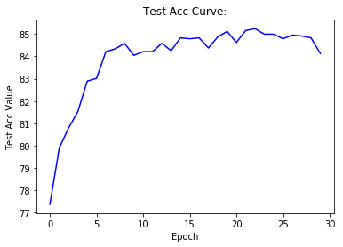
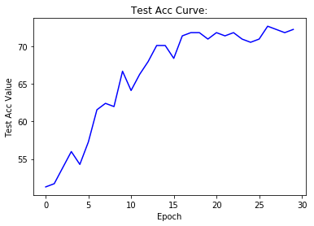
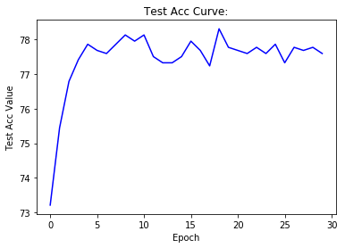
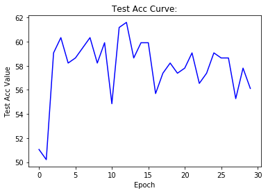

## Final Report For Reproducing Paper

> **Paper title**: [Aspect Based Sentiment Analysis with Gated Convolutional Networks](https://www.aclweb.org/anthology/P18-1234>)
>
> **Authors**: Wei Xue and Tao Li
>
> **My student id and name**: 16340237	Cong Wu

### Abstract

**Aspect based sentiment analysis (ABSA)** can provide more detailed information than general sentiment analysis, because it aims to predict the sentiment polarities of the given aspects or entities in text. The authors summarize previous approaches into two subtasks: **aspect-category sentiment analysis (ACSA)** and **aspect-term sentiment analysis (ATSA)**. 

For general sentiment analysis, TextCNN proposed by Kim is a very classic CNN-based model. But for Aspect based sentiment analysis (ABSA), it seems that **no CNN-based model** has been proposed so far, most previous approaches employ **long short-term memory** and **attention mechanisms** to predict the sentiment polarity of the concerned targets, which are often complicated and need more training time. 

The authors a model based on **convolutional neural networks** and **gating mechanisms**, which is more accurate and efficient. First, the novel **Gated Tanh-ReLU Units** can selectively output the sentiment features according to the given aspect or entity. The architecture is much simpler than attention layer used in the existing models. Second, the computations of our model could be **easily parallelized** during training, because convolutional layers do not have time dependency as in LSTM layers, and gating units also work independently. 

The experiments on SemEval datasets demonstrate the efficiency and effectiveness of the author's models.

### Introduction

Opinion mining and sentiment analysis (Pang and Lee, 2008) on user-generated reviews can provide valuable information for providers and consumers. Instead of predicting the overall sentiment polarity, fine-grained aspect based sentiment analysis (ABSA) (Liu and Zhang, 2012) is proposed to better understand reviews than traditional sentiment analysis.

Specifically, the authors are interested in the sentiment polarity of aspect categories or target entities in the text. Sometimes, it is coupled with aspect term extractions (Xue et al., 2017). 

Many existing models use LSTM layers (Hochreiter and Schmidhuber, 1997) to distill sentiment information from embedding vectors, and apply attention mechanisms (Bahdanau et al., 2014) to enforce models to focus on the text spans related to the given aspect/entity. Such models include Attention-based LSTM with Aspect Embedding (ATAE-LSTM) (Wang et al., 2016b) for ACSA; Target-Dependent Sentiment Classification (TD-LSTM) (Tang et al., 2016a), Gated Neural Networks (Zhang et al., 2016) and Recurrent Attention Memory Network (RAM) (Chen et al., 2017) for ATSA. 

However, both LSTM and attention layer are very timeconsuming during training. Certainly, it is possible to achieve higher accuracy by building more and more complicated LSTM cells and sophisticated attention mechanisms; but one has to hold more parameters in memory, get more hyper-parameters to tune and spend more time in training. 

In this paper, the authors propose a fast and effective neural network for ACSA and ATSA based on convolutions and gating mechanisms, which has much less training time than LSTM based networks, but with better accuracy. 

### Problem formulation 

A number of models have been developed for ABSA, and ABSA can be divided into two subtasks, namely aspect-category sentiment analysis (ACSA) and aspect-term sentiment analysis (ATSA). 

The goal of ACSA is to predict the sentiment polarity with **regard to the given aspect, which is one of a few predefined categories**. On the other hand, the goal of ATSA is to identify the sentiment polarity **concerning the target entities that appear in the text instead, which could be**
**a multi-word phrase or a single word**. The number of distinct words contributing to aspect terms
could be more than a thousand. 

For example, in the sentence “*Average to good Thai food, but terrible delivery.*”, ATSA would ask the sentiment polarity towards the entity *Thai food*; while ACSA would ask the sentiment polarity toward the aspect *service*, even though the word *service* does not appear in the sentence. 

### **Method**

The authors' model GCAE can handle both ACSA task and ATSA task well, but its architecture is slightly different between the two tasks, mainly in the **embedding of the aspect information**. 

For ACSA task, **GCAE mainly consists of an embedding layer, a pair of one-dimension convolutional layer, GTRU gate and a max-pooling layer.** Figure 1 illustrates the authors’ model architecture for ACSA task.

<center><center>
<center><span>Figure 1: Illustration of the authors' model GCAE for ACSA task</span></center>

Suppose we now have a sentence $X$, $X$ contains $L$ words, through the embedding layer, each word can be converted into a $D$-dimension word vector, at this time, the sentence $X$ is represented as a $D\times L$ matrix.
$$
\begin{align}
X&=[v_1, v_2, \cdots, v_L]\tag{1}
\end{align}
$$
The **one-dimension** convolutional layer convolves the embedding vectors input $X$ with multiple convolutional kernels of different widths. We use the filter $W_c \in R^{D\times k}(k<L)$ to scan on the sentence matrix X. For each scan position, we can get a convolution result $X_{i:i+k}*W_c$.

**A pair of convolutional neuron computes features for a pair of gates: tanh gate and ReLU gate. The ReLU gate receives the given aspect information.** The outputs of two gates are element-wisely multiplied, thus, we compute the feature $c_i$ as:
$$
\begin{align}
a_i&=relu(X_{i:i+k}*W_a+V_av_a+b_a)\tag{2}\\\\
s_i&=tanh(X_{i:i+k}*W_s+b_s)\tag{3}\\\\
c_i&=s_i\times a_i\tag{4}
\end{align}
$$
where $v_a$ is the embedding vector of the given aspect category in ACSA.

We can set $n_k$ filters of the same width k, the output features of a sentence then form a matrix $C\in R^{n_k\times L_k}$. For each convolutional filter, the max-over-time pooling layer takes the maximal value among the generated features, i.e., the maximal value of each line of $C$, resulting in a fixed-size vector $e\in R^{n_k}$.

Finally, the final fully-connected layer with softmax function uses the vector $e$ to predict the sentiment polarity $\hat{y}$. The model is trained by minimizing the cross-entropy loss between the ground-truth $y$ and the predicted value $\hat{y}$ for all data samples.

For ATSA task, the given aspect information consists of multiple words instead of one word in ACSA task, **the authors simply extend GCAE by adding a small convolutional layer on aspect terms** to deal with this situation, as shown in Figure 2.

<center><center>
<center><span>Figure 2: Illustration of the authors' model GCAE for ATSA task. It has an additional convolutional layer on aspect terms.</span></center>

In ACSA, the aspect information controlling the flow of the sentiment features in GTRU is from one aspect word; while in ATSA, such information is provided by a small CNN on aspect terms $[w_i, w_{i+1}, \cdots, w_{i+k}]$. The additional CNN extracts the important features from multiple words while retains the ability of parallel computing.

### **Implementation**

#### Dataset

To ensure that the GCAE model I reproduced will be able to get results **similar** to the authors, I use the dataset provided by the author on the Github [wxue004cs/GCAE](https://github.com/wxue004cs/GCAE), which contains 4 datasets in the root directory: `acsa-restaurant-2014`, `acsa-restaurant-large`, `atsa-laptop` and `atsa-restaurant`. 

Since the sentences which have different sentiment labels for different aspects or targets in the sentence are more common in review data than in standard sentiment classification benchmark, to access how the models perform on review sentences more accurately, **the authors create small but hard datasets, which are made up of the sentences having opposite or different sentiments on different aspects/targets**. 

Thus, each dataset contains 4 files for both hard version train/test set and normal version train/test set, for example, `acsa-restaurant-large`  dataset contains `acsa_hard_train.json`, `acsa_hard_test.json`, `acsa_train.json ` and `acsa_test.json`. 

#### Data prepare

As the authors mentioned in the paper, I also removed “conflict” labels from four sentiment labels. 

```python
def sweepAwayConflict(input_data):
    ret = []
    for i in input_data:
        if i['sentiment'] != 'conflict':
            ret.append(i)
    return ret
```

**I use `torchtext` to do data pre-processing, build custom dataset class, load pre-trained GloVe and build data iter.** 

Tokenize, to-lowercase and pre-processing.

```python
sentence_field = data.Field(lower=True, tokenize=WordPunctTokenizer().tokenize, batch_first=True)
if acsa_or_atsa:
    print('Handling acsa tasks.')
    aspect_field = data.Field(sequential=False)
else:
    print('Handling atsa tasks.')
    aspect_field = data.Field(lower=True, tokenize=WordPunctTokenizer().tokenize, batch_first=True)
sentiment_field = data.Field(sequential=False, use_vocab=False)

def clean_str(string):
    """
    Tokenization/string cleaning for all datasets except for SST.
    Original taken from https://github.com/yoonkim/CNN_sentence/blob/master/process_data.py
    """
    string = re.sub(r"[^A-Za-z0-9(),!?\'\`]", " ", string)
    string = re.sub(r"\'s", " \'s", string)
    string = re.sub(r"\'ve", " \'ve", string)
    string = re.sub(r"n\'t", " n\'t", string)
    string = re.sub(r"\'re", " \'re", string)
    string = re.sub(r"\'d", " \'d", string)
    string = re.sub(r"\'ll", " \'ll", string)
    string = re.sub(r",", " , ", string)
    string = re.sub(r"!", " ! ", string)
    string = re.sub(r"\(", " \( ", string)
    string = re.sub(r"\)", " \) ", string)
    string = re.sub(r"\?", " \? ", string)
    string = re.sub(r"\s{2,}", " ", string)
    
    return string.strip()
```

Build custom dataset class.

```python
class GCAEDataSet(data.Dataset):
    
    def __init__(self, sentence_field, aspect_field, sentiment_field, input_data, test=False, **kwargs):
        
        # sentence_field.preprocessing = data.Pipeline(clean_str)
        
        fields = []
        
        examples = []
        
        def sentimentMapping(sentiment):
            if sentiment == 'negative':
                return 0
            elif sentiment == 'neutral':
                return 1
            elif sentiment == 'positive':
                return 2
        
        if test:
            fields = [('sentence', sentence_field), ('aspect', aspect_field), ('sentiment', None)]
            for e in input_data:
                examples.append(data.Example.fromlist([e['sentence'], e['aspect'], None], fields))
        else:
            fields = [('sentence', sentence_field), ('aspect', aspect_field), ('sentiment', sentiment_field)]
            for e in input_data:
                examples.append(data.Example.fromlist([e['sentence'], e['aspect'], sentimentMapping(e['sentiment'])], fields))
        
        
        super(GCAEDataSet, self).__init__(examples, fields, **kwargs)
    
    @classmethod
    def splits(cls, sentence_field, aspect_field, sentiment_field, train_json_data, val_json_data, test_json_data, **kwargs):
        return (cls(sentence_field, aspect_field, sentiment_field, train_json_data, test=False),
                cls(sentence_field, aspect_field, sentiment_field, val_json_data, test=False),
                cls(sentence_field, aspect_field, sentiment_field, test_json_data, test=True))
    
```

Load pre-trained word vectors GloVe, for those words not in GloVe, I randomly initialized them with a uniform distribution $U(-0.25, 0.25)$. 

```python
cache = './vector_cache'
if not os.path.exists(cache):
    os.mkdir(cache)
    
vectors = Vectors(name='glove.840B.300d.txt', cache=cache)

def myUniform(w):
    return nn.init.uniform_(w, a=-0.25, b=0.25)
vectors.unk_init = myUniform
```

Use the loaded GloVe word vectors to build vocabulary, then all the words in sentence and aspect can match their word vector now.

```python
sentence_field.build_vocab(train_dataset, val_dataset, test_dataset, vectors=vectors)
aspect_field.build_vocab(train_dataset, val_dataset, test_dataset, vectors=vectors)
```

Build data iter.

```python
def getDataIter(train_dataset, val_dataset, test_dataset):

    train_iter = BucketIterator(train_dataset, 
                            batch_size=batch_size, 
                            sort_key=lambda x: len(x.sentence), 
                            device=device, 
                            sort=False,
                            sort_within_batch=True, 
                            repeat=False,
                            train=True)


    val_iter = BucketIterator(val_dataset, 
                            batch_size=batch_size, 
                            sort_key=lambda x: len(x.sentence), 
                            device=device, 
                            sort=False,
                            sort_within_batch=True, 
                            repeat=False,
                            train=False)

    test_iter = BucketIterator(test_dataset, 
                            batch_size=batch_size, 
                            sort_key=lambda x: len(x.sentence), 
                            device=device, 
                            sort=False,
                            sort_within_batch=True, 
                            repeat=False,
                            train=False)
    
    return train_iter, val_iter, test_iter
```

#### Network

I mainly use `Pytorch` to build the GCAE model.

```python
class GCAE(nn.Module):
    
    def __init__(self, sentence_field, kernel_num, kernel_sizes, 
                 aspect_field, aspect_kernel_num, aspect_kernel_sizes, dropout):
        
        super(GCAE, self).__init__()
        
        sentence_vocab_size = sentence_field.vocab.vectors.size()[0]
        embedding_dim = sentence_field.vocab.vectors.size()[1]
        self.embedding = nn.Embedding(sentence_vocab_size, embedding_dim)
        self.embedding.weight.data.copy_(sentence_field.vocab.vectors)
        
        aspect_vocab_size = aspect_field.vocab.vectors.size()[0]
        aspect_embedding_dim = aspect_field.vocab.vectors.size()[1]
        self.aspect_embedding = nn.Embedding(aspect_vocab_size, aspect_embedding_dim)
        self.aspect_embedding.weight.data.copy_(aspect_field.vocab.vectors)
        
        self.sentence_a_convs = nn.ModuleList(
            nn.Conv1d(
                in_channels=embedding_dim,
                out_channels=kernel_num,
                kernel_size=kernel_size
            ) for kernel_size in kernel_sizes
        )
        
        self.sentence_s_convs = nn.ModuleList(
            nn.Conv1d(
                in_channels=embedding_dim,
                out_channels=kernel_num,
                kernel_size=kernel_size
            ) for kernel_size in kernel_sizes
        )
        
        self.aspect_convs = nn.ModuleList(
            nn.Conv1d(
                in_channels=aspect_embedding_dim,
                out_channels=aspect_kernel_num,
                kernel_size=aspect_kernel_size
            ) for aspect_kernel_size in aspect_kernel_sizes
        )
        
        self.aspect_linear = nn.Linear(len(aspect_kernel_sizes) * aspect_kernel_num, kernel_num)
        self.dropout = nn.Dropout(dropout)
        self.linear = nn.Linear(len(kernel_sizes) * kernel_num, 3)
        
    def forward(self, sentence, aspect):
        if len(aspect.size()) == 1:
            aspect = aspect.unsqueeze(1)

        sentence = self.embedding(sentence).transpose(1, 2)
        aspect = self.aspect_embedding(aspect).transpose(1, 2)
        
        aspects = [F.relu(aspect_conv(aspect)) for aspect_conv in self.aspect_convs]
        aspects = [F.max_pool1d(aspect, aspect.size(2)).squeeze(2) for aspect in aspects]
        aspect = torch.cat(aspects, dim=1)
        aspect = self.aspect_linear(aspect)
        
        sentences_a = [F.leaky_relu(sentence_a_conv(sentence)) for sentence_a_conv in self.sentence_a_convs]
        sentences_s = [F.relu(sentence_s_conv(sentence) + aspect.unsqueeze(2)) for sentence_s_conv in self.sentence_s_convs]
        sentences = [a*s for a, s in zip(sentences_a, sentences_s)]
        sentences = [F.max_pool1d(sentence, sentence.size(2)) for sentence in sentences]
        sentence = torch.cat(sentences, dim=1).squeeze(2)

        sentence = self.dropout(sentence)
        output = self.linear(sentence)
        
        return output
```


### **Experiments**

In the experimental part I mainly test the following:

- Test 1: ACSA Accuracy on Semval ACSA Restaurant-Large dataset `acsa-restaurant-large` (both normal version and hard version)

  <table>
    <tr>
    	<td></td>
      <td></td>
    </tr>
    <tr>
      <td><center>Accuracy on ACSA Restaurant-Large Normal Test</center></td>
      <td><center>Accuracy on ACSA Restaurant-Large Hard Test</center></td>
    </tr>
  </table>

  In the paper, the author’s accuracy on ACSA Restaurant-Large Normal Test is **85.92±0.27**, my accuracy (above left picture) is **a little over 0.85**, slightly lower than the author's results; the author's accuracy on ACSA Restaurant-Large Hard Test is **70.75±1.19**, my accuracy (above right picture) is basically the same as the author's results.

- Test 2: ATSA Accuracy on Semval ATSA Restaurant dataset `atsa-restaurant` (both normal version and hard version)

  <table>
    <tr>
    	<td></td>
      <td></td>
    </tr>
    <tr>
      <td><center>Accuracy on ATSA Restaurant Hard Test</center></td>
      <td><center>Accuracy on ATSA Restaurant Normal Test</center></td>
    </tr>
  </table>

  In the paper, the author’s accuracy on ATSA Restaurant Normal Test is **77.28±0.32**, my accuracy (above left picture) is **77.85±0.45**, which slightly higher than the author's results; the author's accuracy on ATSA Restaurant Hard Test is **56.73±0.56**, my accuracy is **58.21±3.26 **, which obviously higher that the author's results.

### Conclusion

From the experimental results, the accuracy of the model I reproduced on multiple datasets is roughly in line with the results given by the author in the paper, and slightly better than the author's results.

In the course of the experiment, it takes less than 0.5s to train an epoch on a training set of about 4000 sentences, and only about 7-8 epochs converge, which is better than those using LSTM and attention mechannism. GCAE is much faster!

### **Source code**

> See `GCAE.ipynb` in the root directory, also can find on Github: [DL-Lab-Project](<https://github.com/RQTN/DL-Lab-Project>).


