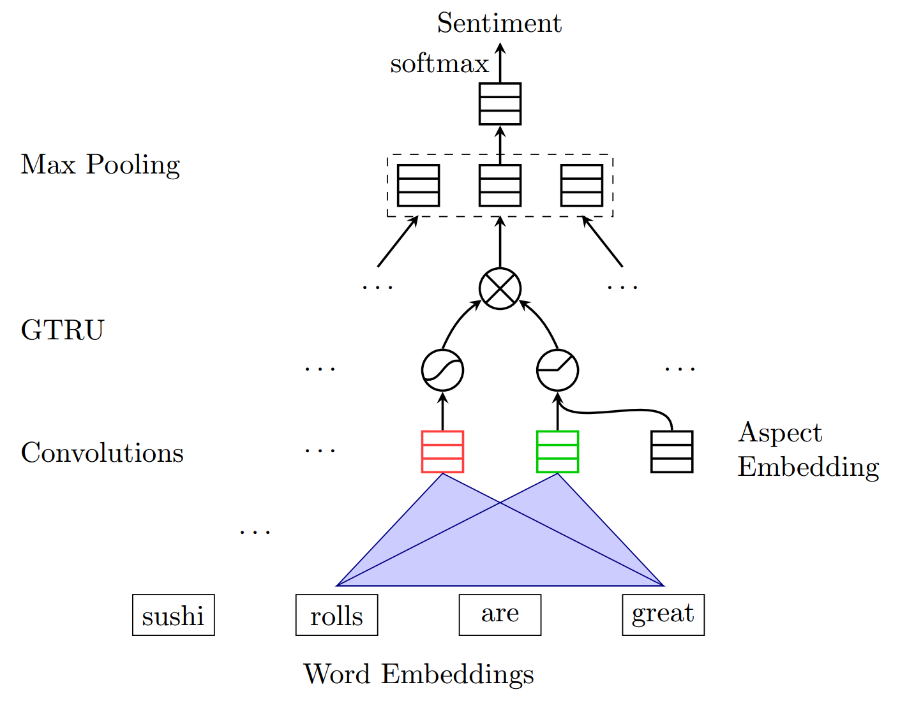
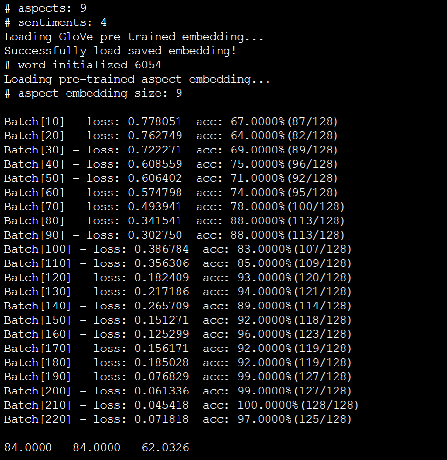
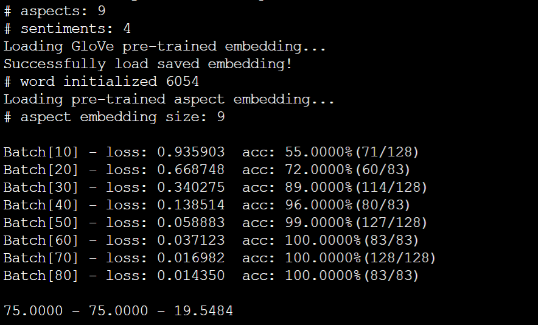

## Midterm Report For Reproducing Paper

> Paper link: [Aspect Based Sentiment Analysis with Gated Convolutional Networks ](<https://www.aclweb.org/anthology/P18-1234>)

### Abstract

For **Aspect based sentiment analysis (ABSA)** task, Most previous approaches employ **long short-term memory** and **attention mechanisms** to predict the sentiment polarity of the concerned targets, which are often complicated and need more training time. 

In this paper, the authors propose a model based on **convolutional neural networks** and **gating mechanisms** to deal with ABSA task, which is more accurate and efficient. 

### Method introduction

ABSA has two different subtasks, namely **aspect-category sentiment analysis (ACSA)** and **aspect-term sentiment analysis (ATSA)**. The authors' model GCAE can handle both tasks well, but its architecture has a little difference between two tasks. In the Midterm Report, I mainly focus ACSA task. 

Figure 1: Illustration of the authors' model GCAE for ACSA task

**GCAE consists of an embedding layer, a pair of one-dimension convolutional layer, GTRU gate and a max-pooling layer.** 

Suppose we now have a sentence $X$, $X$ contains $L$ words, through the embedding layer, each word can be converted into a $D$-dimension word vector, at this time, the sentence $X$ is represented as a $D\times L$ matrix.
$$
X = [v_1, v_2, ..., v_L]
$$
The **one-dimension** convolutional layer convolves the embedding vectors input $X$ with multiple convolutional kernels of different widths. We use the filter $W_c\in R^{D\times k}\ (k<L)$ to scan on the sentence matrix $X$. For each scan position, we can get a convolution result $X_{i:i+k}*W_c$. 

**A pair of convolutional neuron computes features for a pair of gates: tanh gate and ReLU gate. The ReLU gate receives the given aspect information.** The outputs of two gates are element-wisely multiplied, thus, we compute the feature $c_i$ as:
$$
a_i=relu(X_{i:i+k}*W_a+V_av_a+b_a)
$$

$$
s_i=tanh(X_{i:i+k}*W_s+b_s)
$$

$$
c_i=s_i\times a_i
$$

where $v_a$ is the embedding vector of the given aspect category in ACSA.

We can set $n_k$ filters of the same width $k$, the output features of a sentence then form a matrix $C\in R^{n_k\times L_k}$. For each convolutional filter, the max-over-time pooling layer takes the maximal value among the generated features, i.e, the maximal value of each line of $C$, resulting in a fixed-size vector whose size is $n_k$.

Finally, a softmax layer uses the this vector to predict the sentiment polarity of the input sentence.

### Preliminary experimental results

> All datasets used in the experiments are come from SemEval.

By merging SemEval restaurant reviews of three years 2014 - 2016, the authors obtain a larger dataset: acsa-restaurant-large dataset.

To access how the models perform on review sentences more accurately, the authors also create small but difficult datasets, which are made up of the sentences having opposite or different sentiments on different aspects: acsa-restaurant-large hard dataset.

I conduct experiments on both the acsa-restaurant-large dataset dataset and the hard version of the former, batch-size=128 and learning rate=1e-2.

GCAE's performence on acsa-restaurant-large dataset

GCAE's performence on acsa-restaurant-large hard dataset

On acsa-restaurant-large dataset, I finally get 84.00% accuracy on test set in 62 seconds. 

On acsa-restaurant-large hard dataset, I finally get 75.00% accuracy on test set in 19.5 seconds.

### Solved problem

I implemented the GCAE model for ACSA tasks.

Regarding the data preprocessing part of experiments, I mainly use the open source code provided by the authors on github, but the authors' pytorch version is relatively backward, therefore, a few modifications are needed. In addition, pre-trained 300-dimension GloVe vectors also needs to be downloaded in advance.

### To-do

Implement the GCAE model for ATSA tasks.

Try to reproduce more of the experiments mentioned in the paper.

Try to extend the GCAE model to further improve model performance.